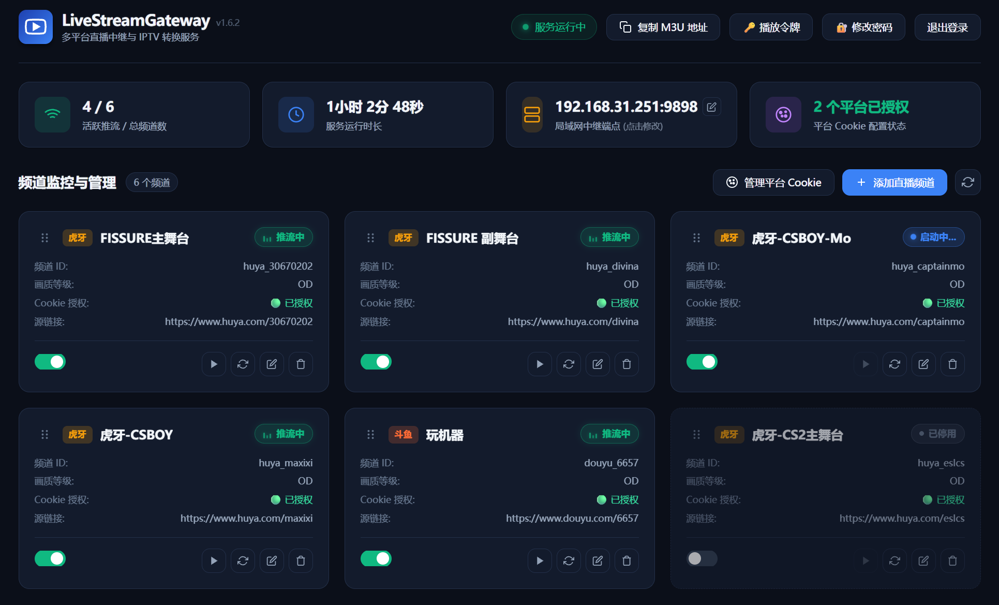

# LiveStreamGateway 🚀

> 基于 **.NET 10** 与 **FFmpeg** 构建的高性能多平台直播流中继网关与 IPTV (M3U) 转换服务。  
> 专为 **Jellyfin / Emby / Kodi / VLC / IPTV 客户端** 打造，彻底解决各大直播平台防盗链签名过期、断流、卡顿及直播边缘漂移等痛点问题。

<p align="center">
  
</p>

---

## 📖 诞生背景与初衷

### 💡 为什么开发这个项目？
许多家庭的（我的）老旧显示设备（例如 **极米 H1 投影仪**、老款智能电视、旧 Android 电视盒子等），其硬件解码芯片和运存配置较低。而如今各大直播平台（虎牙、斗鱼、B站）的官方 TV 版客户端越发臃肿：
- ❌ **客户端臃肿**：充斥着复杂的 UI、礼物动画、弹幕渲染、后台广告与高占用逻辑。
- ❌ **老设备频繁卡死**：在老旧设备上直接运行官方客户端，极易引发**内存溢出、严重卡顿、发热掉帧，甚至直接闪退与系统卡死**。
- ❌ **纯净流难以直接播放**：各大平台的直播流带有严苛的防盗链与短效签名机制（~110秒自动过期），直接把原始链接填进播放器会频繁出现 403 Forbidden 断流。

### 🎯 架构解耦思想
本项目采用 **“边缘中转 + 轻量渲染”** 的解耦架构：
1. **中转服务（Windows / 软路由 / NAS）**：在局域网主机上运行 `LiveStreamGateway`，负责处理最繁琐的 **直播流解析、动态反防盗链重签名、FFmpeg 守护切片与 M3U 网关分发**。
2. **终端播放（极米 H1 / 电视盒子）**：老旧设备上仅需安装极其轻量、纯粹的播放客户端（如 **Jellyfin TV / Emby / Kodi / TiviMate / APTV**），老设备只需负责硬件解码播放纯净流。

> **🎉 实测效果**：极米 H1 等老旧设备彻底摆脱客户端崩溃与卡顿，秒开直播，畅享丝滑稳定的 1080P/4K 原画赛事与主播流！

---

## 🌟 核心技术亮点与解决的痛点

### 1. 🛡️ 虎牙防盗链与短效签名过期 (403 Forbidden)
- **痛点**：虎牙 CDN 直播流的 HLS/FLV 签名（`wsSecret` 与 `wsTime`）通常只有约 110 秒有效期。常规播放器直接播放时，在分片刷新或重连时因签名过期必报 `403 Forbidden`。
- **解决方案**：
  - 内置仅限容器回环访问的**动态透明反向代理端点** (`/huya-source/{channelId}/stream.m3u8`)。
  - **扁平化 Master Playlist (Master Playlist Flattening)**：自动解析多码率主索引，直接提取并重签底层包含实际 TS 分片的 Media Playlist，杜绝播放器/FFmpeg 绕过代理。
  - 动态重签机制按标准 URI 规则重新解析 Master/Media Playlist，并用 1.5s 防抖缓存减少重复请求；过期列表仅允许 6 秒短暂容错，避免反复播放旧片段。
  - 同一频道的清单刷新串行执行，按 `EXT-X-MEDIA-SEQUENCE` 与去除 CDN 签名的分片身份识别时间线 gap/回退；只对确认异常补入 `DISCONTINUITY`，正常滑窗不会触发伪重启。

### 2. ⚡ 直播边缘漂移与长时间播放变卡 (Live Edge Drift)
- **痛点**：HLS 直播采用滑动窗口切片（Sliding Window）。当客户端网络轻微波动或解码延迟，播放位置逐渐落后于最新分片，最终请求到已被服务端删除的旧分片导致 404、严重卡顿、慢动作。
- **解决方案**：
  - 稳健切片策略：`-hls_time 3 -hls_list_size 15 -hls_delete_threshold 10`；媒体序号以 Unix 时间起步，重启后分片文件名不复用，并用 `DISCONTINUITY` 与节目时间戳安全衔接新时间轴。
  - 注入 `#EXT-X-ALLOW-CACHE:NO` 标签，强制 Jellyfin 等客户端紧跟实时直播边缘。
  - 动态剥离 `#EXT-X-ENDLIST` 标记，避免推流短暂重连时播放器误判直播结束自动退出。
  - 后台结合 FFmpeg timestamp discontinuity、跳段和 `Non-monotonic DTS` 证据识别污染时间线，带 20 秒启动保护、90 秒冷却和单频道会话隔离自动重建。
  - 恢复前有界保留故障前/故障时清单、FFmpeg 日志、最近 stderr、输出清单和引用分片，用于追查偶发的卡顿或音频变调。

### 3. 🎯 零转码、超低资源消耗 (Zero-Transcoding)
- 全程采用视频/音频流直通复制（`-c:v copy -c:a copy`），无 CPU/GPU 软硬重编码损耗，即便在软路由、NAS（群晖/威联通/Unraid/飞牛 OS）等低功耗设备上亦可轻松并发多路 4K/原画推流。

### 4. 🔗 智能链接净化与自动秒级识别
- 任意粘贴包含复杂长追踪参数（如 `?hotRank=...&session_id=...`）的直播链接，系统自动过滤并净化为标准 URL；
- 平台全自动识别，无需手动选择虎牙/斗鱼/B站，自动拉取真实频道名称与房间号。

### 5. ⚡ 平台 Cookie 权威真伪鉴权 & 定时健康巡检
- 直连各大平台官方鉴权接口，实时验证 Cookie 真伪与大会员状态；
- 后台守护进程每隔 **30 分钟** 自动进行静默健康巡检；
- 大盘卡片极简状态联动，过期失效时自动以 **🔴 已过期** 红色醒目预警。

### 6. 📺 完美的 IPTV / Jellyfin 协议适配与守护自愈
- 提供便于电视端手动输入的 6 位数字播放令牌 M3U 端点 (`http://<ip>:9898/p/<token>.m3u`)，同一来源 10 分钟内连续输错 5 次会锁定 10 分钟；
- 可在管理面板关闭播放令牌鉴权，供完全不对公网开放的可信局域网环境使用；
- 支持独立频道使能开关，未启用频道自动停止推流并从 M3U 列表中过滤；
- 内置后台健康巡检，同时监控 HLS 清单新鲜度和媒体连续性；遇到卡流、断流或未标记的时间线跳变时，仅自动重建受影响频道。

---

## 🛠️ 支持平台

<table width="100%">
  <thead>
    <tr>
      <th width="95" align="left" nowrap>平台</th>
      <th width="115" align="center" nowrap>状态</th>
      <th width="165" align="center" nowrap>最高画质支持</th>
      <th width="340" align="left" nowrap>说明</th>
    </tr>
  </thead>
  <tbody>
    <tr>
      <td align="left" nowrap><strong>虎牙直播</strong></td>
      <td align="center" nowrap>🟢 完美支持</td>
      <td align="center" nowrap>4K / 原画 / 蓝光</td>
      <td align="left" nowrap>支持动态反防盗链、自动重签、Cookie 鉴权</td>
    </tr>
    <tr>
      <td align="left" nowrap><strong>斗鱼直播</strong></td>
      <td align="center" nowrap>🟢 完美支持</td>
      <td align="center" nowrap>原画 / 蓝光 8M</td>
      <td align="left" nowrap>支持房间长短号解析、Cookie 鉴权</td>
    </tr>
    <tr>
      <td align="left" nowrap><strong>哔哩哔哩</strong></td>
      <td align="center" nowrap>🟢 完美支持</td>
      <td align="center" nowrap>4K / 原画 1080P60</td>
      <td align="left" nowrap>支持大会员高码率/高帧率流、Cookie 鉴权</td>
    </tr>
  </tbody>
</table>

---

## 🏗️ 架构流程图

```text
[虎牙 / 斗鱼 / B站 CDN 直播源]
             │
             ▼ (平台 API 解析 & 动态签名计算)
[LiveStreamGateway 中继网关 (Windows / NAS)]
             │
             ├─► [内置透明反向代理] ──► 动态重签 HLS / 扁平化主索引 / 剥除 ENDLIST
             │          │
             │          ▼
             ├─► [FFmpeg 守护引擎] ──► 极速切片 (Copy Mode, 2s/片, 零编解码)
             │          │
             │          ▼
             └─► [Kestrel HTTP 服务 (默认端口 9898)]
                        │
                        ├─► /p/{token}.m3u (默认：6 位数字令牌鉴权)
                        ├─► /p/{token}/live/{channelId}/stream.m3u8
                        └─► /jellyfin.m3u、/live/* (关闭令牌鉴权时)
                                │
                                ▼
       [极米 H1 / Android 电视盒子 / Apple TV / PC]
       (运行 Jellyfin / Emby / Kodi / TiviMate / APTV)
```

---

## 🖥️ 现代化 Web 管理后台

程序启动后，直接在浏览器中打开：
👉 **`http://<主机IP>:9898`** (本地访问 `http://localhost:9898`)

即可进入现代简洁、自适应移动端的可视化管理控制台：

- 📊 **实时状态大盘**：实时展示当前活跃推流数、服务运行时间、各频道推流状态与重试计数；
- 📺 **频道热重载管理**：在网页端直接**添加、编辑、删除**频道，或者**一键开关、一键重启推流**，改动**实时热生效，无需重启服务**；
- 🔗 **一键识别录入**：粘贴任意直播间复杂链接，一键净化并自动识别平台、标题与房间号；
- 🍪 **平台 Cookie 折叠管理**：固定支持三大平台，支持折叠编辑、一键真伪鉴权检测与定时自动巡检；
- ▶️ **内置 HLS 试播播放器**：采用 hls.js 并监控 PTS/音频解码与真实播放进度；检测到未标记时间线跳变、音频参数变化或持续停滞时，会释放旧 MediaSource 并有界重建播放器；
- 📋 **一键复制 M3U 订阅源**：一键复制 Jellyfin / IPTV 调谐器链接。
- 🔐 **管理员登录保护**：未设置密码时自动进入 Web 首次使用引导；频道、Cookie、主机地址、指标等所有管理 API 均需要登录，密码仅保存 PBKDF2 加盐哈希，支持退出登录和在线修改密码；
- 🔑 **独立播放访问令牌**：新生成令牌为便于电视端输入的 6 位纯数字，并带错误重试锁定；不依赖网页登录状态，管理端可复制、轮换或关闭令牌鉴权；
- 🕶️ **Cookie 原文不回传**：浏览器只接收平台 Cookie 的配置状态，旧 Cookie 不会通过 API 回显。

> [!IMPORTANT]
> Jellyfin/IPTV 的播放端点不要求网页登录，因此管理会话过期不会导致断流。默认启用 6 位数字令牌鉴权；关闭后将使用 `/jellyfin.m3u` 与 `/live/*` 无令牌地址，任何能访问服务端口的设备均可播放，只应在完全不对公网开放的可信局域网中使用。纯 HTTP 无法防止令牌被同网段窃听，跨越不可信网络时请配置 HTTPS 反向代理。

---

<a id="admin-password-setup"></a>
## 🔐 首次访问引导：在面板中创建管理员密码

> [!IMPORTANT]
> **LiveStreamGateway 没有默认管理员密码。** 首次部署，或从没有管理员密码的旧版本升级后，直接访问 Web 面板即可进入创建密码引导，不再需要手工调用 `/api/auth/setup`。

### Docker / NAS 首次设置

1. 启动容器后，在浏览器访问 `http://<NAS或主机IP>:9898`；
2. 面板会自动显示 **“首次使用 · 创建管理员密码”**，而不是普通登录框；
3. 输入并确认一个 **12～256 个字符**的管理员密码；
4. 点击 **“创建密码并进入控制台”**。设置成功后会自动登录，并同时生成独立的 Jellyfin / IPTV 播放令牌。

首次设置不需要默认密码、初始化码或容器命令。无论使用 `localhost`、局域网 IP、Docker/NAS 地址还是 HTTPS 反向代理访问，操作方式都相同。

> [!WARNING]
> 如果服务直接暴露在公网，请在首次启动后立即访问面板完成密码设置，并优先通过防火墙、访问控制或 HTTPS 反向代理限制管理端入口。密码创建完成后，所有管理 API 仍会受到登录会话保护。

### Windows 原生 EXE / 源码运行首次设置

启动 `LiveStreamGateway.exe` 或 `dotnet run` 后，打开 `http://localhost:9898`，或从其它设备访问 `http://<运行主机IP>:9898`。面板会自动显示创建密码引导，输入并确认新密码即可进入控制台，不需要额外初始化码。

### 从旧版本升级

- `AdminPasswordHash` 不存在或为空时，升级后第一次访问自动进入创建密码引导；原有频道、Cookie、推流模式等配置不会被清空；
- 已经设置过管理员密码的实例仍显示普通登录界面，不会重新触发初始化流程；
- 首次设置会自动生成新的 6 位数字播放令牌。已经配置的旧长令牌升级后继续有效，只有主动轮换时才会替换为 6 位数字；
- 如果提交时提示配置写入失败，请检查宿主机映射的 `config.json` 是否为普通文件，以及容器是否拥有写权限。

### 常见问题

| 现象 | 原因与处理方法 |
| :--- | :--- |
| 页面仍显示普通登录界面 | `config.json` 中已经存在管理员密码哈希。请使用原密码登录，或按下方忘记密码流程安全重置。 |
| 提示“密码配置写入失败” | 检查持久化的 `config.json` 是否存在、是否为普通文件，以及容器或程序是否拥有写权限。 |

### 修改密码与忘记密码

- **已知当前密码**：登录管理端，点击顶部 **“🔐 修改密码”**，输入当前密码和新密码即可。其它管理会话会失效，但播放令牌不变，Jellyfin / IPTV 中的现有 M3U 地址无需更新。
- **忘记密码**：由于 `config.json` 中只保存不可逆哈希，项目无法显示、导出或找回原密码。需要执行安全重置：

  1. Docker 用户停止 `live-stream-gateway` 容器；原生运行用户完全退出程序；
  2. 备份 `config.json`（Docker 用户备份宿主机映射的文件，原生运行用户备份程序目录中的文件），不要删除频道、Cookie 等其它配置；
  3. 仅把 `AdminPasswordHash`、`PlaybackTokenHash`、`PlaybackTokenEncrypted` 三个字段的值改为空字符串 `""`；
  4. 重新启动容器或程序，再次访问 Web 面板并按照首次访问引导创建新密码。

> [!WARNING]
> 忘记密码后的安全重置会生成新的 6 位数字播放令牌。启用令牌鉴权时，旧 M3U、HLS 和分片地址会立即失效，必须把管理端显示的新 M3U 地址同步到 Jellyfin / IPTV 客户端；关闭鉴权时，无令牌地址保持不变。重置前务必备份 `config.json`，不要通过删除整个配置文件来重置密码。

不要把 SSH 密码、系统 `root` 密码或直播平台 Cookie 复用为管理员密码。管理员密码只以 `PBKDF2-SHA256` 哈希写入 `config.json`；播放令牌只保存 SHA-256 摘要及由管理员密码通过 AES-256-GCM 加密的恢复密文。

---

## 🐳 Docker / NAS 极速部署

本项目提供了官方多架构 Docker 镜像（支持 `linux/amd64` 与 `linux/arm64`），完美适配 **群晖 (Synology)、威联通 (QNAP)、Unraid、飞牛 OS (fnOS)、TrueNAS 及 Linux 软路由**。

### 方式 1：Docker Compose 一键启动（推荐）

在任意目录下创建 `docker-compose.yml`：

```yaml
services:
  live-stream-gateway:
    image: ghcr.io/yafeiml/livestreamgateway:latest
    container_name: live-stream-gateway
    restart: unless-stopped
    ports:
      - "9898:9898"
    volumes:
      # 持久化配置文件（请确保本地当前目录下有 config.json，可从 config.example.json 复制）
      - ./config.json:/app/config.json
    tmpfs:
      # 【NAS 核心保护优化】将 HLS 切片缓存挂载到系统内存（512M 足够多路并发推流），避免读写机械硬盘导致磨损
      - /app/hls_stream:size=512M,mode=1777
    environment:
      - TZ=Asia/Shanghai
      - ASPNETCORE_ENVIRONMENT=Production
    # 日志轮转配置：单文件限制 50MB，最多保留 3 个文件，避免长期运行占满磁盘
    logging:
      driver: "json-file"
      options:
        max-size: "50m"
        max-file: "3"
    # 容器健康检查
    healthcheck:
      test: ["CMD", "curl", "-f", "-s", "http://localhost:9898/api/health"]
      interval: 30s
      timeout: 5s
      retries: 3
      start_period: 15s
    # 内存资源限制
    deploy:
      resources:
        limits:
          memory: 1G
```

在同级目录下执行启动：
```bash
# 1. 复制一份初始配置文件（若已有可跳过）
curl -sSL https://raw.githubusercontent.com/Yafeiml/LiveStreamGateway/main/config.example.json -o config.json

# 2. 启动容器
docker compose up -d

# 3. 确认容器已启动；然后打开 Web 面板按首次访问引导创建密码
docker compose ps
```

> [!IMPORTANT]
> 容器启动后没有可供尝试的默认密码。请直接访问 `http://<NAS或主机IP>:9898`，按照[首次访问引导](#admin-password-setup)创建密码；不需要查看容器日志或执行初始化命令。

> [!NOTE]
> 活动的媒体连续性异常会使 `/api/health` 和 `/api/ready` 暂时返回 HTTP 503，Docker 因此可能短暂显示 `unhealthy`；程序会在容器内自动重建异常频道，当前 Compose 不会因该状态重启整个容器。证据快照位于 `hls_stream/<频道>/diagnostics/`；该目录在 tmpfs 中，可跨单频道 FFmpeg 重启保留，但容器重建后不保证存在。

#### 🔄 Docker 一键升级
- **Windows 用户**：直接双击仓库自带的 `upgrade.bat` 脚本即可全自动拉取最新镜像、平滑更新并清理旧镜像。
- **Linux / NAS 用户**：在 `docker-compose.yml` 所在目录执行：
  ```bash
  docker compose pull && docker compose up -d --remove-orphans && docker image prune -f
  ```

### 方式 2：Docker 命令行启动

```bash
docker run -d \
  --name live-stream-gateway \
  --restart unless-stopped \
  -p 9898:9898 \
  -v $(pwd)/config.json:/app/config.json \
  --tmpfs /app/hls_stream:size=512M \
  -e TZ=Asia/Shanghai \
  ghcr.io/yafeiml/livestreamgateway:latest
```

容器启动后，请访问 `http://<NAS的IP>:9898`，按照[首次访问引导](#admin-password-setup)在面板中创建密码并进入管理界面。

> [!WARNING]
> ### ⚠️ Windows Docker Desktop / WSL2 部署警告
> **强烈不建议在 Windows Docker Desktop（WSL2 后端）中长期常驻运行多路直播流，尤其不要使用 `"StreamingMode": "AlwaysOn"`。**
> 
> **根因分析**：
> 直播持续拉流会产生高密度的 HLS 网络请求与连接重建。Docker Desktop 的所有容器网络流量均由 Windows 宿主机进程 `com.docker.backend.exe` 转发代理。在部分 Windows 环境下，该代理层可能无法正常释放 TCP 端口和网络缓冲区，导致宿主机 `com.docker.backend.exe` 虚拟内存持续暴涨，最终引发：
> - Windows 物理内存与虚拟分页内存耗尽（系统事件 2004 资源耗尽告警）；
> - Docker Desktop 崩溃无响应，导致所有容器被迫中断；
> - 宿主机 TCP 端口耗尽或系统卡死。
> 
> *注：该泄漏发生在 Docker Desktop 宿主机网络代理层，限制容器内存或修改 `.wslconfig` 内存上限均无法根治。*
> 
> **推荐运行方式**：
> 1. **首选**：原生 Linux Docker Engine（如群晖、威联通、Unraid、飞牛 OS、TrueNAS 或 Linux 主机/软路由）；
> 2. **次选**：Hyper-V / VMware 独立 Linux 虚拟机中的 Docker Engine；
> 3. **Windows 个人电脑**：直接下载 Releases 页面提供的 **Windows 原生独立版 EXE**（解压即跑，不经过 Docker 代理层）；
> 4. **若必须在 Windows Docker Desktop 中使用**：请务必保持使用默认的 **`"StreamingMode": "OnDemand"`（按需推流）**，避免无人观看时持续产生媒体流量。

---

## 🚀 本地 Windows / 源码使用说明

### 步骤 1：准备运行环境
1. 确保安装了 [.NET 10 Runtime / SDK](https://dotnet.microsoft.com/download/dotnet/10.0)（如果从 [Releases](https://github.com/Yafeiml/LiveStreamGateway/releases) 下载独立版则无需安装 .NET，解压即跑）。
2. **准备 FFmpeg**（支持以下任选一种方式）：
   - **方式 1（最简单）**：从 Releases 直接下载打包好的完整压缩包（已内置官方精简版 `ffmpeg.exe`）。
   - **方式 2（环境变量）**：程序会**自动扫描系统 `PATH` 环境变量**，已有 FFmpeg 的电脑无需额外配置。
   - **方式 3（Windows 终端一行命令安装）**：在终端运行 `winget install Gyan.FFmpeg` 即可全自动安装。

### 步骤 2：启动服务
在项目目录下执行：
```bash
dotnet run
```
或直接双击运行下载的 `LiveStreamGateway.exe`。

### 步骤 3：设置管理员密码并登录

程序没有默认管理员密码。首次运行后访问 `http://localhost:9898`，面板会自动显示[首次设置引导](#admin-password-setup)；输入并确认新密码后会自动登录，不需要初始化码。随后可在管理端复制带 6 位数字令牌的 M3U 地址，或按需关闭令牌鉴权。

### 步骤 4：在客户端中挂载播放

#### 方式 A：接入 Jellyfin / Emby（推荐，极米 H1 / 电视盒端）
1. 登录 Jellyfin / Emby 管理后台。
2. 进入 **控制台 -> 电视 (Live TV)** -> **电视源 (Tuner Devices)**。
3. 点击 **添加**，类型选择 **M3U 播放列表 (M3U Tuner)**。
4. **文件或 URL** 填写：
   ```text
   http://<运行主机的局域网IP>:9898/p/<6位播放令牌>.m3u
   ```
   如果已在管理面板关闭令牌鉴权，则填写：
   ```text
   http://<运行主机的局域网IP>:9898/jellyfin.m3u
   ```
5. 保存后，在电视端（如极米 H1 上的 Jellyfin 客户端）打开 **“直播电视” (Live TV)**，即可看到所有频道并流畅播放！

> 升级兼容：已经配置在客户端中的 `/p/<令牌>/jellyfin.m3u` 旧地址仍可继续使用；面板从本版本开始默认显示更易手动输入的 `/p/<6位令牌>.m3u`。

#### 方式 B：接入通用 IPTV 播放器 (TiviMate / APTV / PotPlayer / VLC)
- 直接在播放器中添加订阅源 URL：
  ```text
  http://<运行主机的局域网IP>:9898/p/<6位播放令牌>.m3u
  ```
- 关闭令牌鉴权时，订阅源改为 `http://<运行主机的局域网IP>:9898/jellyfin.m3u`；
- 或单独播放单个频道：
  ```text
  http://<运行主机的局域网IP>:9898/p/<播放令牌>/live/<频道Id>/stream.m3u8
  ```

---

## ⚙️ 配置文件详细说明 (`config.json`)

配置文件包含 **管理密码哈希**、**播放令牌摘要/密文及鉴权开关**、**全局推流与网络参数**、**CookieProfiles（凭据池）** 与 **Channels（频道列表）**。`AdminPasswordHash`、`PlaybackTokenHash`、`PlaybackTokenEncrypted` 均由初始化或轮换接口自动写入，请勿手工填写明文；`PlaybackTokenAuthEnabled` 默认为 `true`。

### 完整配置示例

```json
{
  "CustomHost": "",
  "AdminPasswordHash": "",
  "PlaybackTokenHash": "",
  "PlaybackTokenEncrypted": "",
  "PlaybackTokenAuthEnabled": true,
  "StreamingMode": "AlwaysOn",
  "IdleTimeoutSeconds": 300,
  "StartupTimeoutSeconds": 30,
  "PrewarmEnabledChannels": [],
  "CookieProfiles": {
    "huya": "guid=xxx; udb_guiddata=xxx; udb_biztoken=xxx; ...",
    "douyu": "（可选：填入斗鱼网页版 Cookie）",
    "bilibili": "（可选：填入 B 站网页版 Cookie）"
  },
  "Channels": [
    {
      "Id": "huya_eslcs",
      "Name": "虎牙-CS赛事",
      "Platform": "huya",
      "Url": "https://www.huya.com/eslcs",
      "Quality": "OD",
      "CookieProfileKey": "huya",
      "Enable": true
    },
    {
      "Id": "douyu_dota2",
      "Name": "斗鱼-DOTA2赛事",
      "Platform": "douyu",
      "Url": "https://www.douyu.com/9999",
      "Quality": "OD",
      "CookieProfileKey": "douyu",
      "Enable": true
    },
    {
      "Id": "huya_streamer_backup",
      "Name": "虎牙-备用频道",
      "Platform": "huya",
      "Url": "https://www.huya.com/660004",
      "Quality": "OD",
      "CookieProfileKey": "huya",
      "Enable": false
    }
  ]
}
```

### 字段说明表

#### 1. 全局核心配置项
| 字段 | 类型 | 默认值 | 说明 |
| :--- | :--- | :---: | :--- |
| `StreamingMode` | string | `"AlwaysOn"` | **推流模式**：<br>• `"AlwaysOn"`（默认）：全天候常驻推流模式，所有启用频道保持后台持续切片转流，客户端进入零等待秒开；<br>• `"OnDemand"`：按需推流，无客户端观看时 FFmpeg 自动待机（零媒体流量），用户打开播放时自动秒级拉起（推荐用于 Windows Docker Desktop 或带宽紧张场景）。 |
| `IdleTimeoutSeconds` | int | `300` | **空闲待机超时（秒）**：在 `OnDemand` 模式下，当最后一个播放客户端停止请求超过该秒数后，网关自动停止该频道的 FFmpeg 进程以节省带宽与系统资源。 |
| `StartupTimeoutSeconds` | int | `30` | **启动等待超时（秒）**：在 `OnDemand` 模式下，客户端首次访问触发 FFmpeg 启动时，等待生成首个 HLS 切片播放列表的最大容忍时长。 |
| `PrewarmEnabledChannels` | string[] | `[]` | **预热启动频道 ID 列表**：在 `OnDemand` 模式下，允许指定某些核心赛事或高频频道在程序启动时立即拉起 FFmpeg，无需等待首次播放请求。 |
| `CustomHost` | string | `""` | **局域网真实主机 IP / 域名**：在 Docker 容器化桥接网络或通过 `localhost` 访问时，可显式指定 NAS/电脑真实 IP（如 `192.168.10.2`），生成的 M3U 与流地址将自动固定使用该地址。留空则自适应客户端 Host。可在 Web 控制台随时点击修改。 |

#### 2. `CookieProfiles`（凭据池）
| 字段 | 类型 | 说明 |
| :--- | :--- | :--- |
| `Key` (如 `huya`) | string | 平台代号（`huya` / `douyu` / `bilibili`） |
| `Value` | string | 从浏览器 F12 抓取的直播平台完整 Cookie 字符串（配置后可直接获取最高原画/蓝光 4K 码率） |

#### 3. `Channels`（频道列表）
| 字段 | 类型 | 必填 | 说明 |
| :--- | :--- | :---: | :--- |
| `Id` | string | 是 | 频道唯一英文字符串标识（用于 HLS 路由与缓存目录命名，如 `huya_eslcs`） |
| `Name` | string | 是 | 频道显示名称（在 Jellyfin / IPTV 电视列表中展示的频道名） |
| `Platform` | string | 是 | 直播平台代号：可选 `huya` (虎牙)、`douyu` (斗鱼)、`bilibili` (B站) |
| `Url` | string | 是 | 直播间的完整网页 URL（支持房间号、靓号或个性域名） |
| `Quality` | string | 否 | 画质偏好：`OD`(原画) / `BD`(蓝光) / `HD`(超清) / `SD`(高清)，默认 `OD` |
| `CookieProfileKey` | string | 否 | 关联的 CookieProfile 键名（如 `huya`），留空或不填则使用免登录画质 |
| `Enable` | bool | 否 | **频道开关**：`true` 正常拉流并导出到 M3U；`false` 禁用该频道（自动释放进程且不显示在列表中） |

---

## 📄 开源许可证

本项目基于 [MIT 许可证](LICENSE) 开源。仅供个人技术研究、局域网家庭多媒体串流与老旧设备复用交流，严禁用于任何商业营利用途。
